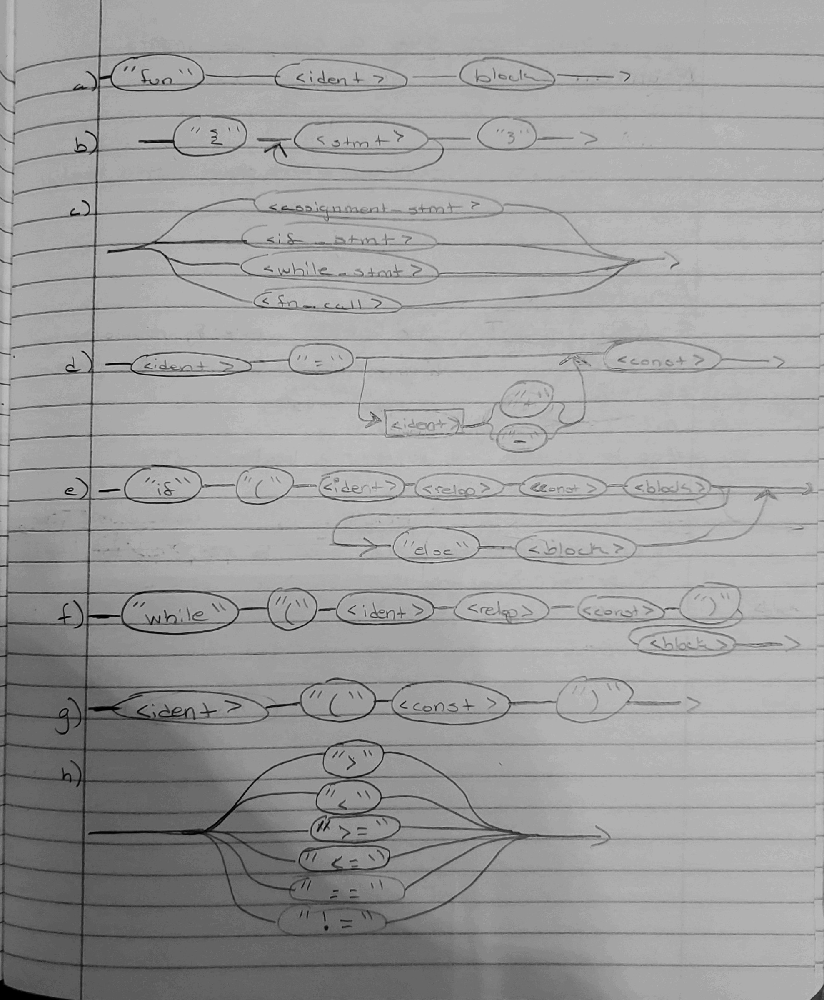
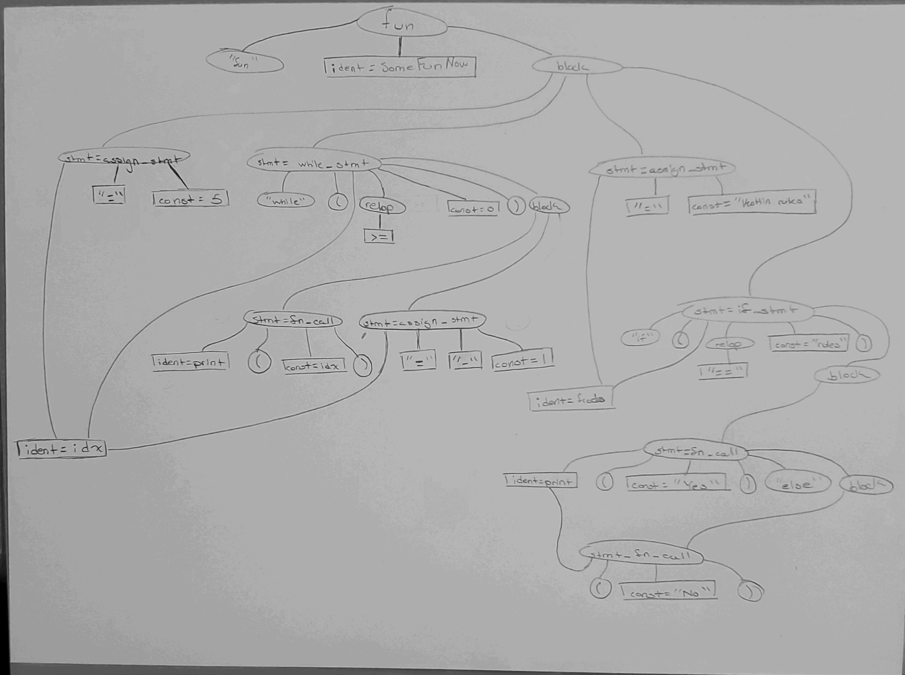

# Assignment 7 - AST and Kotlin
This Kotlin program accepts a list of words from the command line to which will perform average word length (mean) and standard deviation algorithms based on the word length for the list of words in the list using each words' length and amount of words for computation.

## Setup

The Kotlin program will be run using `kotlinc`


## Running

From the command line:

```
kotlinc -d hw7.jar -include-runtime hw7.kt
java -jar hw7.jar word_1 word_2 word_3
```
or
```
kotlinc -d hw7.jar -include-runtime hw7.kt
java -jar hw7.jar "word_1" "word_2" "word_3"
```

## Notes: 
In the commmand line with the "word_1" and word_1, replace with words that you want program to be performed on (these are just placeholders). Follow each word with a space.

### Part 2a


### Part 2b

Production | | | Derivation
---------- |--|--| -----------
a | <fun\>             | -> | "fun" <ident= SomeFunNow\> <block\>
b | <block\>           | -> | "{" <stmt\> { <stmt\> } "}"
c | <stmt\>            | -> | <assignment_stmt\>
d | <assignment_stmt\> | -> | <ident= idx\> "=" <const= 5\>
f | <while_stmt\>      | -> | "while" "(" <ident= idx\> <relop\> <const= 0\>")" <block\>
h | <relop\>           | -> | ">="
b | <block\>           | -> | "{" <stmt\> { <stmt\> } "}"
c | <stmt\>            | -> | <fn_call\>
g | <fn_call\>         | -> | <ident= print> "(" <const= idx> ")"
c | <stmt\>            | -> | <assignment_stmt\>
d | <assignment_stmt\> | -> | <ident= idx\> "=" <ident= idx\> ( "-" ) <const=1\>
c | <stmt\>            | -> | <assignment_stmt\>
d | <assignment_stmt\> | -> | <ident= frodo\> "=" <const= Kotlin rules\>
e | <if_stmt\>         | -> | "if" "(" <ident= frodo\> <relop\> <const= rules\> ")" <block\> ["else" <block\>]
h | <relop\>           | -> | "=="
b | <block\>           | -> | "{" <stmt\> { <stmt\> } "}"
c | <stmt\>            | -> | <fn_call\>
g | <fn_call\>         | -> | <ident= print\> "(" <const= Yes\> ")"
b | <block\>           | -> | "{" <stmt\> { <stmt\> } "}"
c | <stmt\>            | -> | <fn_call\>
g | <fn_call\>         | -> | <ident= print\> "(" <const= No\> ")"

### Part 2c

